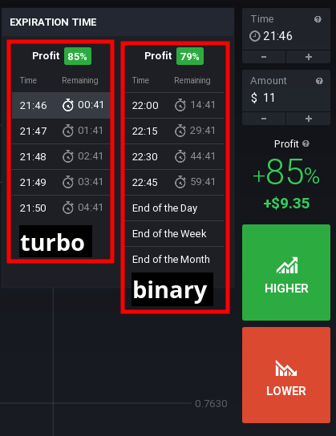
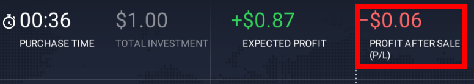
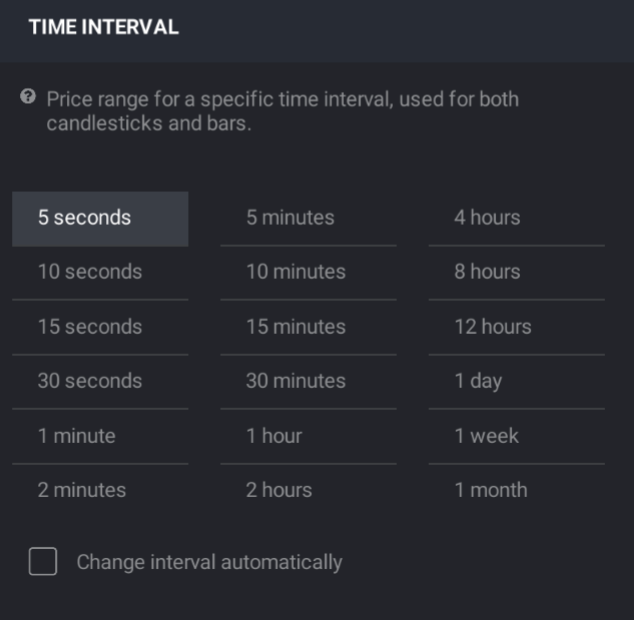

# IQOPTION API

Version 1.0

####  Websocket 0.56

```bash
pip3 uninstall websocket-client
pip3 install websocket-client==0.56
```
---

## Installation & GET new version
For Python3
```bash
pip3 install -U git+git://github.com/Lu-Yi-Hsun/iqoptionapi.git
```
---
## Option
```python
import time
from iqoptionapi.stable_api import IQ_Option
myiq=IQ_Option("email","password")
pair="EURUSD"
print(myiq.get_candles(pair,60,111,time.time()))
```
---
### Check version

```python
from iqoptionapi.stable_api import IQ_Option
print(IQ_Option.__version__)
```
### <a id=checkconnect> Check connect</a>

return True/False

```python
print(myiq.check_connect())
```

### <a id=reconnect>Reconnect</a>
```python
myiq.connect()
```
---

### <a id=checkopen>Check Asset if open or not</a>

:exclamation:be careful get_all_open_time() is very heavy for network.

get_all_open_time() return the DICT

DICT["digital"/"turbo"/"binary"][Asset Name]["open"]

it will return True/False
 
```python
Asset=myiq.get_all_open_time()
#check if open or not
print(Asset["turbo"]["EURUSD"]["open"])
print(Asset["binary"]["EURUSD"]["open"])
print(Asset["digital"]["EURUSD-OTC"]["open"])
```
---

### For all

#### get_async_order

get the order data by id 

```python
from iqoptionapi.stable_api import IQ_Option
import logging
import time
#logging.basicConfig(level=logging.DEBUG,format='%(asctime)s %(message)s')
myiq=IQ_Option("email","password")
 
ACTIVES="EURUSD"
duration=1#minute 1 or 5
amount=1
action="call"#put

print("__For_Binary_Option__")
_,id=myiq.buy(amount,ACTIVES,action,duration)
while myiq.get_async_order(id)==None:
    pass
print(myiq.get_async_order(id))
print("\n\n")

print("__For_Digital_Option__spot")
id=myiq.buy_digital_spot(ACTIVES,amount,action,duration)
while myiq.get_async_order(id)==None:
    pass
order_data=myiq.get_async_order(id)
print(myiq.get_async_order(id))
print("\n\n")
```
#### <a id=getcommissionchange>get_commission_change</a>


instrument_type: "binary-option"/"turbo-option"/"digital-option"

- myiq.subscribe_commission_changed(instrument_type)

- myiq.get_commission_change(instrument_type)

- myiq.unsubscribe_commission_changed(instrument_type)

```python
import time
from iqoptionapi.stable_api import IQ_Option
myiq=IQ_Option("email","password")
#instrument_type: "binary-option"/"turbo-option"/"digital-option"/"crypto"/"forex"/"cfd"
instrument_type=["binary-option","turbo-option","digital-option","crypto","forex","cfd"]
for ins in instrument_type:
    myiq.subscribe_commission_changed(ins)
print("Start stream please wait profit change...")
while True:
    for ins in instrument_type:
        commissio_data=myiq.get_commission_change(ins)
        if commissio_data!={}:
            for active_name in commissio_data:
                if commissio_data[active_name]!={}:
                    the_min_timestamp=min(commissio_data[active_name].keys())
                    commissio=commissio_data[active_name][the_min_timestamp]
                    profit=(100-commissio)/100
                    print("instrument_type: "+str(ins)+" active_name: "+str(active_name)+" profit change to: "+str(profit))
                    #Data have been update so need del
                    del myiq.get_commission_change(ins)[active_name][the_min_timestamp]
    time.sleep(1)
```
### For Options

#### <a id=buy>BUY</a>

```python
from iqoptionapi.stable_api import IQ_Option
import logging
import time
logging.basicConfig(level=logging.DEBUG,format='%(asctime)s %(message)s')
myiq=IQ_Option("email","pass")
goal="EURUSD"
print("get candles")
print(myiq.get_candles(goal,60,111,time.time()))
Money=1
ACTIVES="EURUSD"
ACTION="call"#or "put"
expirations_mode=1

check,id=myiq.buy(Money,ACTIVES,ACTION,expirations_mode)
```

```python
myiq.buy(Money,ACTIVES,ACTION,expirations)
                #Money:How many you want to buy type(int)
                #ACTIVES:Sample input "EURUSD" OR "EURGBP".... you can view by get_all_ACTIVES_OPCODE
                #ACTION:"call"/"put" type(str)
                #expirations:input minute,careful too large will false to buy(Closed market time)thank Darth-Carrotpie's code (int)https://github.com/Lu-Yi-Hsun/iqoptionapi/issues/6
                #return:if sucess return (True,id_number) esle return(Fale,None) 
```
#### <a id=buymulti>buy_multi</a>

```python
from iqoptionapi.stable_api import IQ_Option
myiq=IQ_Option("email","password")
Money=[]
ACTIVES=[]
ACTION=[]
expirations_mode=[]

Money.append(1)
ACTIVES.append("EURUSD")
ACTION.append("call")#put
expirations_mode.append(1)

Money.append(1)
ACTIVES.append("EURAUD")
ACTION.append("call")#put
expirations_mode.append(1)

print("buy multi")
id_list=myiq.buy_multi(Money,ACTIVES,ACTION,expirations_mode)

print("check win only one id (id_list[0])")
print(myiq.check_win_v2(id_list[0]))
```

#### <a id=getremaning>get_remaning</a>

purchase time=remaning time - 30

```python
from iqoptionapi.stable_api import IQ_Option
myiq=IQ_Option("email","password")
Money=1
ACTIVES="EURUSD"
ACTION="call"#or "put"
expirations_mode=1
while True:
    remaning_time=myiq.get_remaning(expirations_mode)
    purchase_time=remaning_time-30
    if purchase_time<4:#buy the binary option at purchase_time<4
        myiq.buy(Money,ACTIVES,ACTION,expirations_mode)
        break
```

#### <a id=selloption>sell_option</a>

```python
myiq.sell_option(sell_all)#input int or list
```

Sample

```python
from iqoptionapi.stable_api import IQ_Option
import time
print("login...")
myiq=IQ_Option("email","password")

Money=1
ACTIVES="EURUSD"
ACTION="call"#or "put"
expirations_mode=1

id=myiq.buy(Money,ACTIVES,ACTION,expirations_mode)
id2=myiq.buy(Money,ACTIVES,ACTION,expirations_mode)

time.sleep(5)
sell_all=[]
sell_all.append(id)
sell_all.append(id2)
print(myiq.sell_option(sell_all))
```
#### check win

(only for option)

It will do loop until get win or loose

:exclamation:
   it have a little problem when network close and reconnect miss get "listInfoData"

this function will doing Infinity loop

```python
myiq.check_win(23243221)
#""you need to get id_number from buy function""
#myiq.check_win(id_number)
#this function will do loop check your bet until if win/equal/loose
```
##### check_win_v2

(only for option)

more better way

an other way to fix that(implement by get_betinfo)

input by int

```python
from iqoptionapi.stable_api import IQ_Option
myiq=IQ_Option("email","password")
check,id = myiq.buy(1, "EURUSD", "call", 1)
print("start check win please wait")
print(myiq.check_win_v2(id))
```

---
"get_binary_option_detail" and "get_all_profit" are base on "get_all_init()",if you want raw data you can call
```python
myiq.get_all_init()
```

---

<a id=expirationtime></a>



#### get_binary_option_detail

Sample 
```python
from iqoptionapi.stable_api import IQ_Option
print("login...")
myiq=IQ_Option("email","password")
d=myiq.get_binary_option_detail()
print(d["CADCHF"]["turbo"])
print(d["CADCHF"]["binary"])
```

#### get all profit
Sample 
```python
from iqoptionapi.stable_api import IQ_Option
print("login...")
myiq=IQ_Option("email","password")
d=myiq.get_all_profit()
print(d["CADCHF"]["turbo"])
print(d["CADCHF"]["binary"])
```
---
#### get_betinfo

(only for option)

it will get infomation about Bet by "id"

:exclamation:

if your bet(id) not have answer yet(game_state) or wrong id it will return False
input by int

```python
 
isSuccessful,dict=myiq.get_betinfo(4452272449)
#myiq.get_betinfo 
#INPUT: int
#OUTPUT:isSuccessful,dict

```
#### <a id=optioninfo>get_optioninfo</a>

input how many data you want to get from Trading History(only for binary option)

```
print(myiq.get_optioninfo(10))
```
#### <a id=optioninfo>get_optioninfo_v2</a>

input how many data you want to get from Trading History(only for binary option)

```
print(myiq.get_optioninfo_v2(10))
```
#### <a id=getoptionopenbyotherpc>get_option_open_by_other_pc</a>

if your account is login in other plance/PC and doing buy option

you can get the option by this function

```python
import time
from iqoptionapi.stable_api import IQ_Option
myiq=IQ_Option("email","password")
while True:
    #please open website iqoption and buy some binary option
    if myiq.get_option_open_by_other_pc()!={}:
        break
    time.sleep(1)
print("Get option from other Pc and same account")
print(myiq.get_option_open_by_other_pc())

id=list(myiq.get_option_open_by_other_pc().keys())[0]
myiq.del_option_open_by_other_pc(id)
print("After del by id")
print(myiq.get_option_open_by_other_pc())
```

___
---
### <a id=digital>For Digital</a>
[Digital options buy with actual price Sample code](https://github.com/Lu-Yi-Hsun/iqoptionapi/issues/65#issuecomment-511660908)

#### Sample

```python
from iqoptionapi.stable_api import IQ_Option
import time
import random
myiq=IQ_Option("email","password")

ACTIVES="EURUSD"
duration=1#minute 1 or 5
amount=1
myiq.subscribe_strike_list(ACTIVES,duration)
#get strike_list
data=myiq.get_realtime_strike_list(ACTIVES, duration)
print("get strike data")
print(data)
"""data
{'1.127100': 
    {  'call': 
            {   'profit': None, 
                'id': 'doEURUSD201811120649PT1MC11271'
            },   
        'put': 
            {   'profit': 566.6666666666666, 
                'id': 'doEURUSD201811120649PT1MP11271'
            }	
    }............
} 
"""
#get price list
price_list=list(data.keys())
#random choose Strategy
choose_price=price_list[random.randint(0,len(price_list)-1)]
#get instrument_id
instrument_id=data[choose_price]["call"]["id"]
#get profit
profit=data[choose_price]["call"]["profit"]
print("choose you want to buy")
print("price:",choose_price,"side:call","instrument_id:",instrument_id,"profit:",profit)
#put instrument_id to buy
buy_check,id=myiq.buy_digital(amount,instrument_id)
if buy_check:
    print("wait for check win")
    #check win
    while True:
        check_close,win_money=myiq.check_win_digital_v2(id)
        if check_close:
            if float(win_money)>0:
                win_money=("%.2f" % (win_money))
                print("you win",win_money,"money")
            else:
                print("you loose")
            break
    myiq.unsubscribe_strike_list(ACTIVES,duration)
else:
    print("fail to buy,please run again")
```
#### <a id=strikelist>Get all strike list data</a>

##### Data format

```python

{'1.127100': {  'call': {'profit': None, 'id': 'doEURUSD201811120649PT1MC11271'},   'put': {'profit': 566.6666666666666, 'id': 'doEURUSD201811120649PT1MP11271'}	}.......}  
```

##### Sample

```python
from iqoptionapi.stable_api import IQ_Option
import time
myiq=IQ_Option("email","password")
ACTIVES="EURUSD"
duration=1#minute 1 or 5
myiq.subscribe_strike_list(ACTIVES,duration)
while True:
    data=myiq.get_realtime_strike_list(ACTIVES, duration)
    for price in data:
        print("price",price,data[price])
    time.sleep(5)
myiq.unsubscribe_strike_list(ACTIVES,duration)
```

#### <a id=buydigitalspot>buy_digital_spot</a>

buy the digit in current price

```python
from iqoptionapi.stable_api import IQ_Option
 
myiq=IQ_Option("email","password")

ACTIVES="EURUSD"
duration=1#minute 1 or 5
amount=1
action="call"#put
print(myiq.buy_digital_spot(ACTIVES,amount,action,duration))
```

#### <a id=getdigitalspotprofitaftersale>get_digital_spot_profit_after_sale</a>

get Profit After Sale(P/L)

```python
from iqoptionapi.stable_api import IQ_Option 
myiq=IQ_Option("email","passord")
ACTIVES="EURUSD"
duration=1#minute 1 or 5
amount=100
action="put"#put
 
myiq.subscribe_strike_list(ACTIVES,duration)
id=myiq.buy_digital_spot(ACTIVES,amount,action,duration) 
 
while True:
    PL=myiq.get_digital_spot_profit_after_sale(id)
    if PL!=None:
        print(PL)
     
```

#### <a id=getdigitalcurrentprofit>get_digital_current_profit</a>

get current price profit


```python
from iqoptionapi.stable_api import IQ_Option
import time
import logging
#logging.basicConfig(level=logging.DEBUG,format='%(asctime)s %(message)s')
myiq=IQ_Option("email","password")
ACTIVES="EURUSD"
duration=1#minute 1 or 5
myiq.subscribe_strike_list(ACTIVES,duration)
while True:
    data=myiq.get_digital_current_profit(ACTIVES, duration)
    print(data)#from first print it may be get false,just wait a second you can get the profit
    time.sleep(1)
myiq.unsubscribe_strike_list(ACTIVES,duration)
```

#### Buy digit
```python
buy_check,id=myiq.buy_digital(amount,instrument_id)
#get instrument_id from myiq.get_realtime_strike_list
```
#### check win for digital

##### check_win_digital


this api is implement by get_digital_position()

```python
myiq.check_win_digital(id)#get the id from myiq.buy_digital
#return:check_close,win_money
#return Sample
#if you loose:Ture,o
#if you win:True,1232.3
#if trade not clode yet:False,None
```
##### <a id=checkwindigitalv2>check_win_digital_v2</a>
 
:exclamation::exclamation: this api is asynchronous get id data,it only can get id data before you call the buy action. if you restart the program,the asynchronous id data can not get again,so check_win_digital_v2 may not working,so you need to use "check_win_digital"!

```python
myiq.check_win_digital_v2(id)#get the id from myiq.buy_digital
#return:check_close,win_money
#return Sample
#if you loose:Ture,o
#if you win:True,1232.3
#if trade not clode yet:False,None
```

Sample code

```python
from iqoptionapi.stable_api import IQ_Option
import logging
import random
import time
import datetime
#logging.basicConfig(level=logging.DEBUG,format='%(asctime)s %(message)s')
myiq=IQ_Option("email","password")


ACTIVES="EURUSD"
duration=1#minute 1 or 5
amount=1
action="call"#put
id=(myiq.buy_digital_spot(ACTIVES,amount,action,duration))
print(id)
if id !="error":
    while True:
        check,win=myiq.check_win_digital_v2(id)
        if check==True:
            break
    if win<0:
        print("you loss "+str(win)+"$")
    else:
        print("you win "+str(win)+"$")
else:
    print("please try again")
```


#### close digital
```python
myiq.close_digital_option(id)
```
#### get digital data

##### Sample1

```python
from iqoptionapi.stable_api import IQ_Option
import logging
import time
#logging.basicConfig(level=logging.DEBUG,format='%(asctime)s %(message)s')
myiq=IQ_Option("email","password")
ACTIVES="EURUSD-OTC"
duration=1#minute 1 or 5
amount=1
action="call"#put
from datetime import datetime
 
id=myiq.buy_digital_spot(ACTIVES,amount,action,duration) 

while True:
    check,_=myiq.check_win_digital(id)
    if check:
        break
print(myiq.get_digital_position(id))
print(myiq.check_win_digital(id))
```
#####Sample 2

```python
#print(myiq.get_order(id))#not work for digital
print(myiq.get_positions("digital-option"))
print(myiq.get_digital_position(2323433))#in put the id
print(myiq.get_position_history("digital-option"))
```
---

### Candle

#### get candles
:exclamation:

 get_candles can not get "real time data" ,it will late about 30sec

if you very care about real time you need use 

"get realtime candles" OR "collect realtime candles"

Sample 

""now"" time 1:30:45sec

1.  you want to get  candles 1:30:45sec now
    
    you may get 1:30:15sec data have been late approximately 30sec

2.  you want to get  candles 1:00:33sec 

    you will get the right data

```python
myiq.get_candles(ACTIVES,interval,count,endtime)
            #ACTIVES:Sample input "EURUSD" OR "EURGBP".... youcan
            #interval:duration of candles
            #count:how many candles you want to get from now to past
            #endtime:get candles from past to "endtime"
```
:exclamation:
try this code to get more than 1000 candle
```python
from iqoptionapi.stable_api import IQ_Option
import time
myiq=IQ_Option("email","password")
end_from_time=time.time()
ANS=[]
for i in range(70):
    data=myiq.get_candles("EURUSD", 60, 1000, end_from_time)
    ANS =data+ANS
    end_from_time=int(data[0]["from"])-1
print(ANS)
```

#### get realtime candles

##### Sample 
```python
from iqoptionapi.stable_api import IQ_Option
import logging
import time
#logging.basicConfig(level=logging.DEBUG,format='%(asctime)s %(message)s')
print("login...")
myiq=IQ_Option("email","password")
goal="EURUSD"
size="all"#size=[1,5,10,15,30,60,120,300,600,900,1800,3600,7200,14400,28800,43200,86400,604800,2592000,"all"]
maxdict=10
print("start stream...")
myiq.start_candles_stream(goal,size,maxdict)
#DO something
print("Do something...")
time.sleep(10)

print("print candles")
cc=myiq.get_realtime_candles(goal,size)
for k in cc:
    print(goal,"size",k,cc[k])
print("stop candle")
myiq.stop_candles_stream(goal,size)
```
 
##### start_candles_stream
 
* input:
    * goal:"EURUSD"...
    * size:[1,5,10,15,30,60,120,300,600,900,1800,3600,7200,14400,28800,43200,86400,604800,2592000,"all"]
    * maxdict:set max buffer you want to save

Time Interval



##### get_realtime_candles
* input:
    * goal:"EURUSD"...
    * size:[1,5,10,15,30,60,120,300,600,900,1800,3600,7200,14400,28800,43200,86400,604800,2592000,"all"]
* output:
    * dict
##### stop_candles_stream
* input:
    * goal:"EURUSD"...
    * size:[1,5,10,15,30,60,120,300,600,900,1800,3600,7200,14400,28800,43200,86400,604800,2592000,"all"]

---
### time

#### <a id=timestamp> get_server_timestamp</a>
the get_server_timestamp time is sync with iqoption
```python
myiq.get_server_timestamp()
```

#### <a id=purchase>Purchase Time</a>
this Sample get the Purchase time clock
```python
import time

#get the end of the timestamp by expiration time
def get_expiration_time(t):
    exp=time.time()#or myiq.get_server_timestamp() to get more Precision
    if (exp % 60) > 30:
        end = exp - (exp % 60) + 60*(t+1)
    else:
        end = exp - (exp % 60)+60*(t)
    return end
    
expiration_time=2

end_time=0
while True:
    if end_time-time.time()-30<=0:
        end_time = get_expiration_time(expiration_time)
    print(end_time-time.time()-30)
    time.sleep(1)
```
---
### Get top_assets_updated

instrument_type="binary-option"/"digital-option"/"forex"/"cfd"/"crypto"

```python
from iqoptionapi.stable_api import IQ_Option
import logging
import time
#logging.basicConfig(level=logging.DEBUG,format='%(asctime)s %(message)s')
myiq=IQ_Option("email","password")
instrument_type="digital-option"#"binary-option"/"digital-option"/"forex"/"cfd"/"crypto"
myiq.subscribe_top_assets_updated(instrument_type)

print("__Please_wait_for_sec__")
while True:
    if myiq.get_top_assets_updated(instrument_type)!=None:
        print(myiq.get_top_assets_updated(instrument_type))
        print("\n\n")
    time.sleep(1)
myiq.unsubscribe_top_assets_updated(instrument_type)
```

#### get popularity by top_assets_updated() api

https://github.com/Lu-Yi-Hsun/iqoptionapi/issues/131


```python
from iqoptionapi.stable_api import IQ_Option
import logging
import time
import operator
 
#logging.basicConfig(level=logging.DEBUG,format='%(asctime)s %(message)s')
def opcode_to_name(opcode_data,opcode):
    return list(opcode_data.keys())[list(opcode_data.values()).index(opcode)]            

myiq=IQ_Option("email","password")
myiq.update_ACTIVES_OPCODE()
opcode_data=myiq.get_all_ACTIVES_OPCODE()

instrument_type="digital-option"#"binary-option"/"digital-option"/"forex"/"cfd"/"crypto"
myiq.subscribe_top_assets_updated(instrument_type)


print("__Please_wait_for_sec__")
while True:
    if myiq.get_top_assets_updated(instrument_type)!=None:
        break

top_assets=myiq.get_top_assets_updated(instrument_type)
popularity={}
for asset in top_assets:
    opcode=asset["active_id"]
    popularity_value=asset["popularity"]["value"]
    try:
        name=opcode_to_name(opcode_data,opcode)
        popularity[name]=popularity_value
    except:
        pass
 
 
sorted_popularity = sorted(popularity.items(), key=operator.itemgetter(1))
print("__Popularity_min_to_max__")
for lis in sorted_popularity:
    print(lis)

myiq.unsubscribe_top_assets_updated(instrument_type)
```


---
### Account

#### get balance
```python
myiq.get_balance()
```

 
#### <a id=resetpracticebalance>reset practice balance</a>

reset practice balance to $10000

```python
from iqoptionapi.stable_api import IQ_Option
myiq=IQ_Option("email","password")
print(myiq.reset_practice_balance())
```

#### Change real/practice Account
```python
myiq.change_balance(MODE)
                        #MODE: "PRACTICE"/"REAL"
```

---
